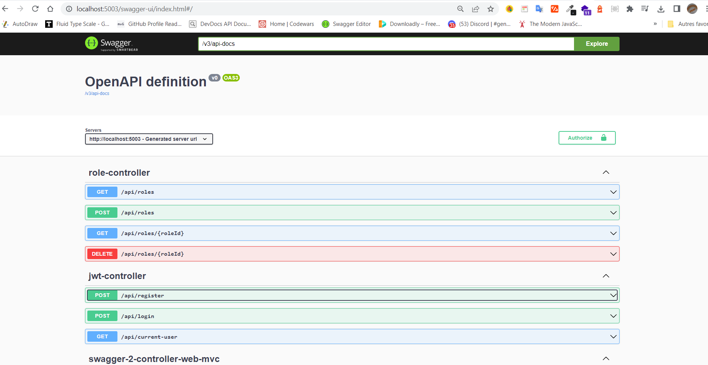

# springboot-todo-app-apis
I built secured APIs with Spring Security and testing it with Postman API or Swagger UI that I have implemented inside the application. And I deployed it in Heroku for production

# All APIs

Please provide url, username and password of your own online or local MySQL database
in application.yml file

To see all the APIs , copy and paste this link in your browser
[https://evening-garden-93563.herokuapp.com/swagger-ui/index.html](https://evening-garden-93563.herokuapp.com/swagger-ui/index.html)

- POST https://glacial-sands-98241.herokuapp.com/roles (without Bearer Token) : to create role
- GET https://glacial-sands-98241.herokuapp.com/roles (with Bearer Token): to get all roles
- GET https://glacial-sands-98241.herokuapp.com/roles/{id} (with Bearer Token): to get a specific role
- POST https://glacial-sands-98241.herokuapp.com/register (without Bearer Token) : to create an user
- POST https://glacial-sands-98241.herokuapp.com/login (without Bearer Token) : to get a token after authentication
- GET https://glacial-sands-98241.herokuapp.com/current-user (with Bearer Token): to get a current user
- GET https://glacial-sands-98241.herokuapp.com/hello (with Bearer Token): to get a data like "Hello World"

# Testing
** I recommand you to use Postman API to test your Apis and all will go best**

To run application locally, run command like : 

`mvnw install` 

`java -jar ./target/<jar_name>.jar`

You can use swagger-ui to test APIs like this :

